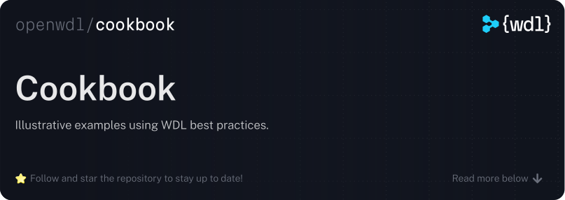

  

 

This repository contains a set of illustrative examples, dubbed "recipes", that explain
how to accomplish common use-cases. These are intended to be complementary to [the
official WDL documentation][wdl-docs]. Feel free to [join Slack][join-slack] if you have
any questions!

> [!NOTE]  
> The recipes in this repository were copied verbatim from an older version of [the
> official WDL documentation][wdl-docs]. They have not yet been cleaned up from that
> transition yet and, thus, some links may be broken. That being said, we believe that
> the examples are illustrative and generally helpful, so we continue to make them
> available here in that form.

### License

The WDL cookbook is made available to you under the permissive [BSD 3-Clause
License](./LICENSE).

© 2025-Present The OpenWDL Developers

[join-slack]:
    https://join.slack.com/t/openwdl/shared_invite/zt-ctmj4mhf-cFBNxIiZYs6SY9HgM9UAVw
[wdl-docs]: https://docs.openwdl.org
